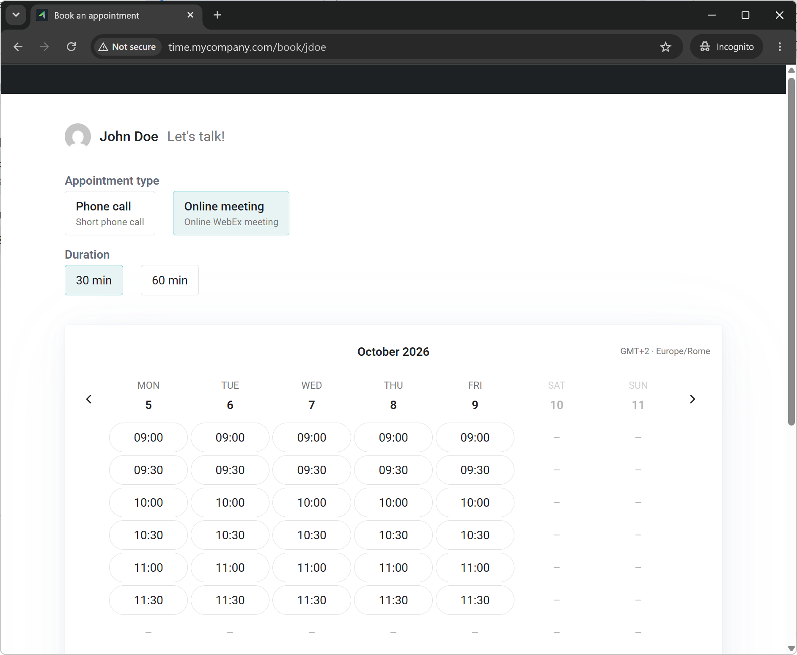

# Domino Time

Self-service appointment booking for HCL Domino.

Give each Domino user a short public link (e.g. `https://time.company.com/schedule/jdoe`). Anyone with the link — no Notes account required — sees the user's real availability, picks an appointment type, duration and slot, and sends a request protected by a captcha.

The request lands in the user's own Notes calendar as a **draft meeting**: the user reviews it and sends the invite when ready. A notification memo is also delivered to the user's mailbox.



## Features

- Availability is computed from the user's real calendar, working hours, Out of Office settings and User availability.
- Each request is written as an `Appointment` document. The requester is only stored as an invitee (not yet invited), so nothing is sent until the user sends the invitation.
- The slot is checked again at confirmation time to avoid double bookings.
- The captcha is stateless: an AES-GCM encrypted token, no server-side session and no fonts nor dependencies required on the server.
- The user's avatar on the booking page is fetched from [Gravatar](https://gravatar.com), based on their e-mail address.
- Available in **English**, **Italian**, **German** and **French**. The booking page automatically uses the language in use in the visitor's browser, falling back to English for any other language.

Tested with Domino server versions: **12**, **14**, **14.5** and **14.5.1**.

## Setup

First-time setup of the server and the database.

### 1. Database

Requires HCL Domino 12 or later. The application is distributed as a template (`time.ntf`):

1. Sign the template with the server ID, or with a user ID that has write access to the users' mail files.
2. Create a new database using the `DominoTime` template.
3. Check the ACL:
   - `Anonymous` must have **Reader** access, with no additional attributes.
   - (Optional) Users (e.g. `*/Org`) have **Author** access, so they can manage the settings of their own profile (e.g. suspend bookings, change appointment types, durations, availability...), without the **Create documents** attribute.

The services run as the signer, so that ID must also be able to read the Domino Directory.

### 2. Internet Site: allow Anonymous access

The Internet Site that serves the database can be shared with other applications or dedicated to Domino Time. In both cases it must allow anonymous access. In the Internet Site document, open the **Security** tab and set **Anonymous** to **Yes**:

- in the **TCP authentication** section, if Domino exposes HTTP;
- in the **TLS authentication** section, if Domino exposes (also) HTTPS.

### 3. Web Site Rule

Public URLs have two levels: `<keyword>/<user slug>`, e.g. `/calendar/time.nsf/schedule/jdoe`. The **keyword is fully custom**: it can be any word you like (`schedule`, `book`, `meet`...), it only has to match between the rule and the URLs you hand out.

Create a new **Web Site Rule** with these fields:

| Field | Value |
| --- | --- |
| Description | `Domino Time` |
| Type of rule | `Substitution` |
| Incoming URL pattern | `/calendar/time.nsf/schedule/*` |
| Replacement pattern | `/calendar/time.nsf/index.html#` |

In general: incoming pattern `<DbPath>/<keyword>/*`, replacement pattern `<DbPath>/index.html#`.

### 4. Reverse proxy (recommended)

The service is meant for **anonymous** users, so a reverse proxy in front of Domino is strongly recommended, to apply rate limiting and other protections against mass requests.

With a dedicated host (e.g. `time.company.com`) the URLs can be shortened to `https://time.company.com/schedule/<slug>`.

**Apache**

```apache
ProxyPassMatch "^/(.+)$" "http://<domino>/calendar/time.nsf/$1"
ProxyPassReverse "/" "http://<domino>/calendar/time.nsf/"
```

**nginx**

```nginx
location / {
    proxy_pass http://<domino>/calendar/time.nsf/;
    proxy_redirect http://<domino>/calendar/time.nsf/ /;
    proxy_set_header Host $host;
    proxy_set_header X-Forwarded-For $proxy_add_x_forwarded_for;
}
```

## Setting up users

In Notes, create a **User** document for every user who accepts bookings. The user's public URL is `<DbPath>/<keyword>/<slug>`.

The application is designed so that administrators (**Editor** access or higher) create the user profiles. Accordingly, the **User**, **Mail server**, **Mail file path** and **Slug (short link)** fields can only be edited by users with Editor access or higher. All the other fields can be edited by the profile's own user, since the **User** field is an *Authors* field.

| Field | Description |
| --- | --- |
| Enabled | Checkbox. When cleared, online booking is suspended for this user |
| User | Canonical name of the Domino user (as in the Domino Directory) |
| Mail server | Server of the user's mail database. Leave blank to use the server Domino Time is running on |
| Mail file path | Path of the user's mail database |
| Slug (short link) | The short-URL part identifying the user, e.g. `jdoe` |
| Welcome text | Welcome text shown on the booking page |
| Appointment types | Up to three appointment types: name, description and allowed durations (30 to 120 minutes, e.g. `30, 60, 120`) |

Optional settings:

| Field | Description |
| --- | --- |
| Booking limit | Checkbox. When selected, bookings are limited to the next `AdvanceDays` days |
| Maximum days | Number of days that can be booked (used only when `AdvanceLimit` is selected). The value is always evaluated, so a more complex rule is possible too — e.g. *up to next Friday* — using a formula such as `14 - @Modulo(@Weekday(@Today) + 5; 7) - 1` |
| Monday ... Sunday | Checkbox, one per weekday. When selected, a list of start/end pairs can be provided: e.g. `09:00`, `13:00`, `14:00`, `16:00` means 9-13 and 14-16 |

By default the bookable hours are the user's availability, as set in Notes under *More > Preferences... > Calendar & To-Do > Scheduling > Availability*. With an override, only the listed ranges of that day are bookable, so a day can be restricted (e.g. 9-13 and 14-16 instead of 9-13 and 14-18).

**Limitation:** an override must be a subset of the user's availability. Time outside the availability is never bookable, and no error is reported if a range goes beyond it (e.g. an override on Saturday has no effect if Saturday is not a working day).

The time zone is read from the `Timezone` field of the user's Calendar Profile (mail file).

The user's e-mail address is read from the Domino Directory (`InternetAddress` item of the Person document).

## Building the Java sources

The Java sources are built with Maven into a single `domino-time.jar`, which you then import into the NSF as a Jar File design element in Designer.

```bash
mvn package
```

The jar is written to `target/domino-time.jar`.

The build compiles against `Notes.jar` and several XPages Extension Library / Domino Services OSGi jars, all proprietary HCL/IBM jars not published on Maven Central. No jar is ever copied into the project: the build resolves them directly from a local Notes/Domino Designer install, via two environment variables (or the equivalent `-D` override, see `pom.xml`):

| Variable | Points to | Example |
| --- | --- | --- |
| `NOTES_HOME` | The Notes/Domino Designer install root | `C:\Notes` |
| `EXTLIB_VERSION` | The release qualifier shared by the OSGi plugin jars under `$NOTES_HOME\osgi\shared\eclipse\plugins\`, e.g. from `com.ibm.xsp.extlib.core_14.5.1.v00_00_20260302-2103.jar` | `14.5.1.v00_00_20260302-2103` |

```bash
mvn package -Dnotes.home="C:/Notes" -Dextlib.version="14.5.1.v00_00_20260302-2103"
```

json-simple and the Servlet API are resolved from Maven Central at compile time only (`provided` scope): they are not bundled into `domino-time.jar`. json-simple still needs its own Jar File design element in the NSF (see below); the Servlet API is supplied by Domino itself at runtime.

## Third-party components and attributions

- [json-simple](https://code.google.com/archive/p/json-simple/) (`org.json.simple`), [Apache License 2.0](LICENSE).
- HCL Domino / XPages Extension Library APIs, provided by the Domino server.
- Application icon: [Calendar icons created by iconfield - Flaticon](https://www.flaticon.com/free-icons/calendar "calendar icons").
- Favicon: the one used by HCL Verse, which is the property of HCL.

## License

Domino Time (Java sources and NSF design) is released under the [Apache License 2.0](LICENSE). You may use, modify and redistribute it for free, provided that the copyright and attribution notices are kept.

The web front-end is distributed compiled inside the NSF. Its sources are not part of this repository: please get in touch if you are interested.